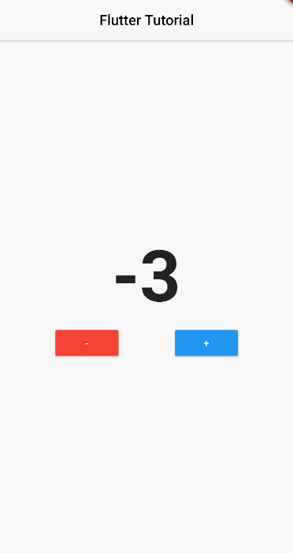

# 1주차

---

- 해당화면과 최대한 똑같이 만들어봐요!
- 로직 구성
    1.  splash screen 화면이 나타난지 5초 후, 다음 화면으로 넘어갈 것.
    2. +, - 버튼과 숫자를 표현해주는 화면이 나타납니다. +, - 버튼을 눌렀을 때, 가운데 숫자가 변해야합니다. 🙂
- setState함수와 iniState를 이용할 것.
- 화면을 넘겨주는 함수: Navigator.pushReplacementNamed()
- 검색을 통해, 다른 사람이 쓴 코드를 참고 및 인용해서 써도 됩니다. 다만 해당 코드를 이해하고 써야겠죠? 😉
